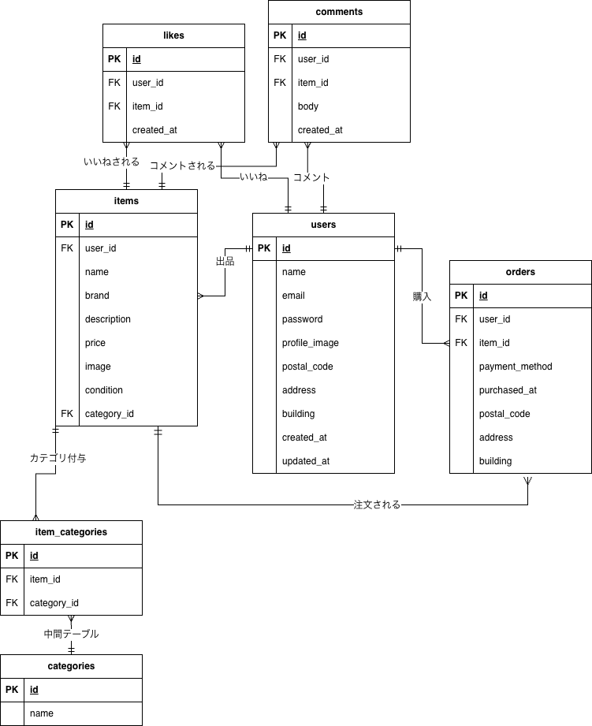

# フリマアプリ

## 環境構築

- git clone git@github.com:yume0606/test-marketplace-app.git
- docker-compose up -d --build

## Laravel環境構築

- cp .env.example .env
- docker run --rm \
  -u "$(id -u):$(id -g)" \
  -v "$(pwd):/var/www/html" \
  -w /var/www/html \
  -e COMPOSER_CACHE_DIR=/tmp/composer_cache \
  laravelsail/php82-composer:latest \
  composer install
- ./vendor/bin/sail up -d
- ./vendor/bin/sail artisan key:generate
- ./vendor/bin/sail artisan migrate
- ./vendor/bin/sail artisan db:seed

## .envのDB設定

- DB_CONNECTION=mysql
- DB_HOST=mysql
- DB_PORT=3306
- DB_DATABASE=laravel
- DB_USERNAME=sail
- DB_PASSWORD=password

## 実行環境

- PHP 8.2 / Laravel 10.x
- MySQL 8.4
- Docker (Laravel Sail-8.5)

## ER図

## URL

## マイグレーションリセット＆再実行

- ./vendor/bin/sail artisan migrate:fresh

## phpMyAdmin

- http://localhost:8080
